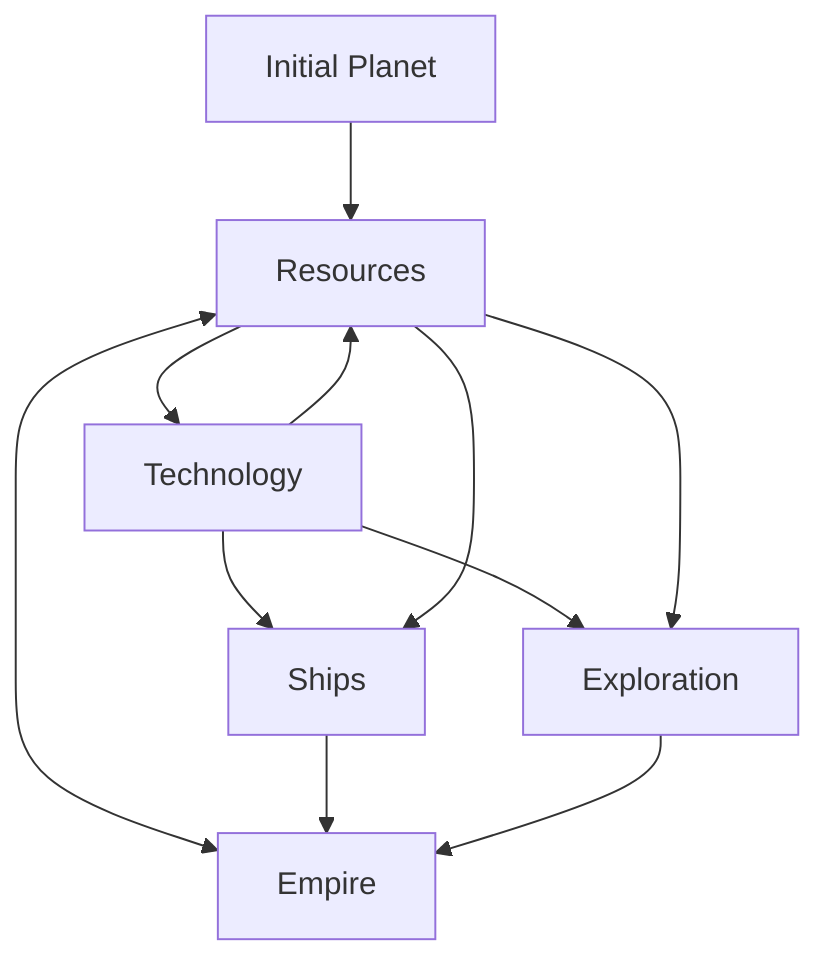

Simple Idle Space Themed Game

Outline:
* Gather resources
* Build ships from resources
* Gain technologies
* To explore the galaxy/universe
* Build empire

Each planet in the empire will not consume resources after initial cost

There will be no combat

Technologies:
* Automators - resources, ships, exploration, empire building
* Ships - explore, empire building
* Terraforming - empire building

Goals:
* Get all the resources, explore all the planets/solar systems, 

Resources:
* Resources will be needed for every action. Resources will be infinite
* Resources will be generic: Metal, Minerals, Energy
* Energy will be: wood/oil/gas/solar/fission/fusion - but maybe will never be split out like that, and will just be simply 'energy'
* Start with metal and mineral resources, manual gathering, to then build an energy creation system.

Rough mermaid diagram:

List of things to do:

* Gather resources manually
* Technology Tree System - IN PROGRESS
 * Technology for energy - TODO
 * Technology for automators - TODO
 * Technology for ships - TODO
 * Technology for exploration - TODO
 * Technology for terraforming - TODO
 * Technology for empire - TODO
* Increase speed of resource collection - TODO
