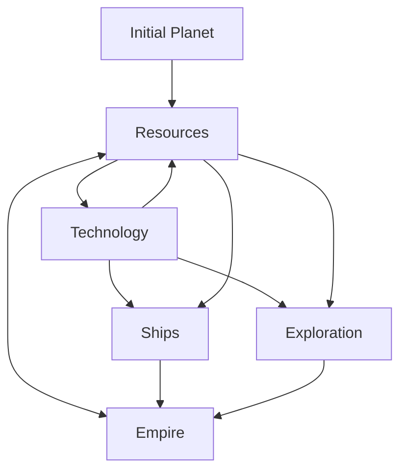
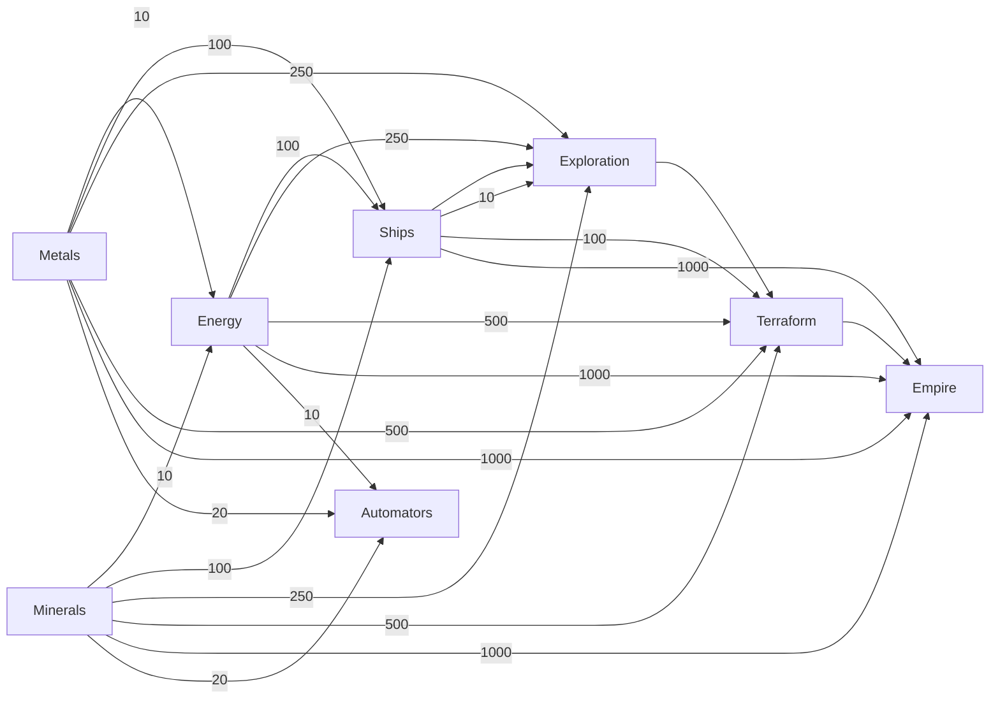

# Cosmic Idle
Simple Idle Game - Space Themed

> [!WARNING]
> Very much a work in progress at this time.

## Game Outline:
* Gather resources
* Build ships from resources
* Gain technologies
* To explore the galaxy/universe
* Build empire

## How to run:
```
git clone https://github.com/tidalvirus/cosmicidle.git
cd cosmicidle
uv run main.py
```

## List of things to do:

- [x] Gather resources manually - DONE
- [x] Technology Tree System - IN PROGRESS - can unlock technologies
 - [x] Technology for energy - DONE
 - [x] Technology for automators - DONE
 - [x] Technology for ships - DONE
 - [x] Technology for exploration - DONE
 - [x] Technology for terraforming - DONE
 - [x] Technology for empire - DONE
- [ ] Increase speed of resource collection - TODO


## Other notes:
Each planet in the empire will not consume resources after initial cost

There will be no combat

Technologies:
* Automators - resources, ships, exploration, empire building
* Ships - explore, empire building
* Terraforming - empire building

Goals:
* Get all the resources, explore all the planets/solar systems, 

Resources:
* Resources will be needed for every action. Resources will be infinite
* Resources will be generic: Metal, Minerals, Energy
* Energy will be: wood/oil/gas/solar/fission/fusion - but maybe will never be split out like that, and will just be simply 'energy'
* Start with metal and mineral resources, manual gathering, to then build an energy creation system.

Rough mermaid diagram:


Crazy diagram for initial tech tree:

